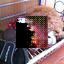
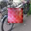
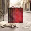
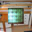
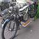
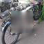
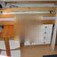

## Next model : Conditional GANs

In this model I tried to take advantages of generative models to solve the problem. The main idea is extracted from [this article](https://swarbrickjones.wordpress.com/2016/01/13/enhancing-images-using-deep-convolutional-generative-adversarial-networks-dcgans/). 

The previous model was a simple convolutional auto-encoder. We extend the idea by adapting this model with GANs as follow. for the generator we used the convolutional auto-encoder with slightly different architectural improvement , from [DCGANS article](https://arxiv.org/abs/1511.06434) , and for the discriminator we used a regular convolution network with sigmoid layer at the end. The learning algorithm is exactly like the previous model. I'm not sure about the problem but I could not get good enough result with this model.

 

 

 

 

Training took only 8 epochs. I changed the original architecture because it needed too much resources for training. The model architecture is as follow : for the generator we have 6 layer of convolution with filter size of 64 and stride of 2 and pad of 2. I didn’t use any pooling layer and full connected layer and for every layer except the and the last I used batch norm. I used tanh non linearity for the last layer. For the discriminator I used three layers of deconvolution with leaky relu non linearity and used sigmoid in the last layer. 

### Summary:

-- output was not good

## First model : Convolutional auto-encoder

For the starting point, I chose convolutional auto-encoder. It was my first experience to implement neural net using Theano. The network was trained using SGD (Adam) algorithm. 
For the architecture I used three layers of (Conv , Maxpooling) with filter size of 5 and 32 filters and pool size of 2. And for the bottle-neck there is a full connected neural net with 800 hidden units which represent latent variable.
The resulted images are as follow:

 

 

 

 

The hyperparameters were : learning rate = 0.0009 , number of epochs = 200 , batch size = 64
For the training phase I used early stopping with patience of 2. Training process only took 12 epoch, so it was pretty fast.

### Summary:

-- Without using captions

-- Fast training

-- blurry results

### Future:

-- Try generative models like GANs , VAEs conditioning on captions and incomplete image
